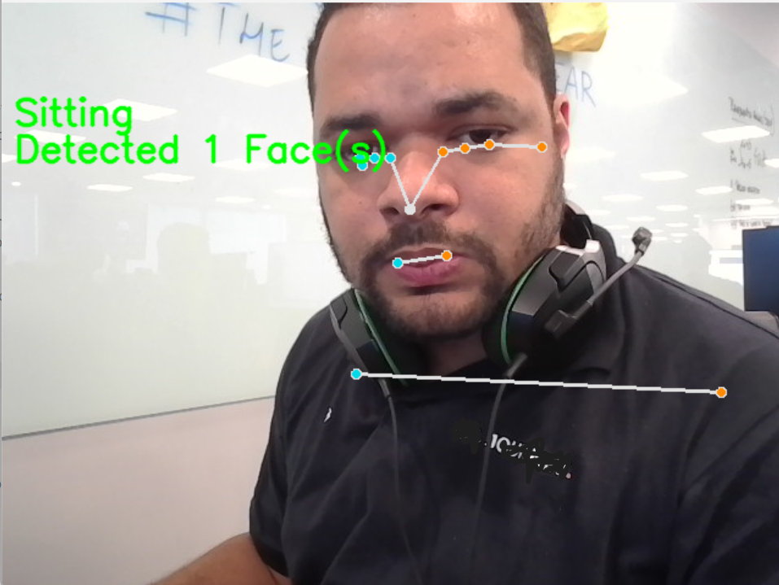
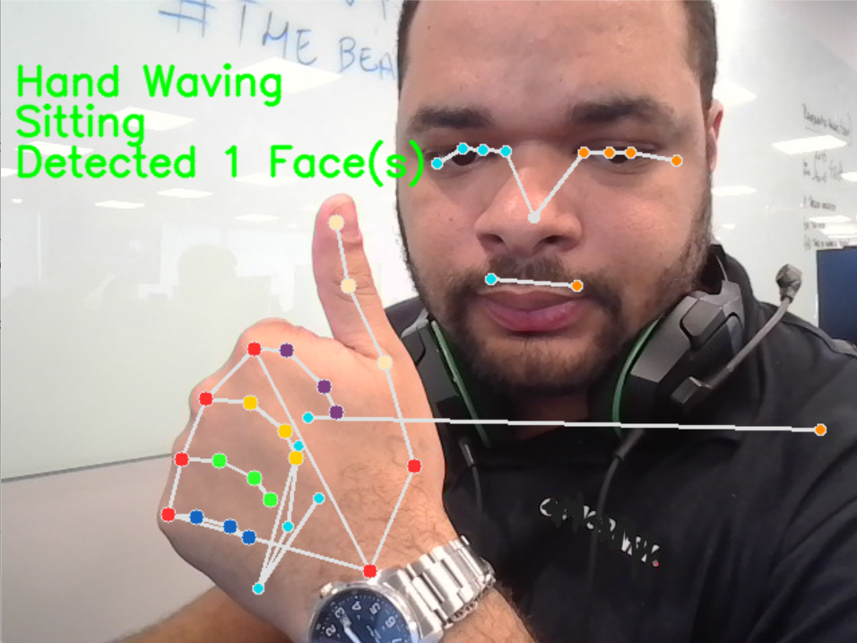
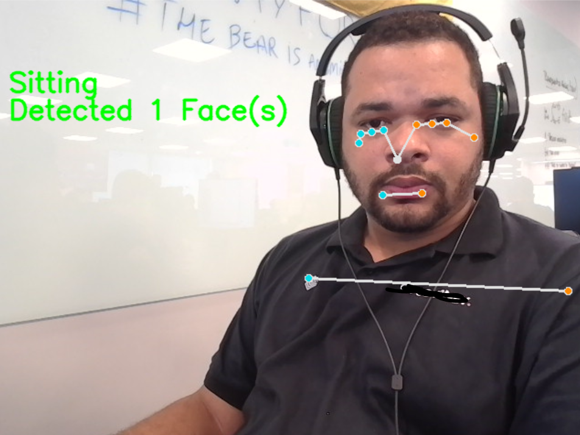

# Mediapipe Gesture, Posture, and Face Detection

This repository contains a Python application that utilizes the Mediapipe library for real-time gesture recognition, posture detection, and face detection. The project is designed to be modular and extensible, allowing developers to add new gestures and postures easily.

## Features

- **Gesture Recognition**: Recognizes gestures such as "Thumbs Up," "Peace Sign," "Pointing," "Hand Waving," "Middle Finger Raised," and counts visible fingers.
- **Posture Detection**: Detects postures like "Sitting," "Standing," "Straight Posture," and "Jumping."
- **Face Detection**: Identifies and counts the number of visible faces in the frame.
- **Real-Time Processing**: Processes video feed from the webcam in real-time.
- **Modular Design**: Easy to add new gestures and postures by extending the `MediapipeProcessor` class.

## Requirements

- Python 3.8 or later
- Mediapipe
- OpenCV

## Installation

1. Clone the repository:
   ```bash
   git clone https://github.com/preduus/gesture-posture-recognition-mediapipe.git
   cd gesture-posture-recognition-mediapipe
   ```

2. Create a virtual environment (optional but recommended):
   ```bash
   python -m venv venv
   source venv/bin/activate  # On Windows use `venv\Scripts\activate`
   ```

3. Install the required Python packages:
   ```bash
   pip install -r requirements.txt
   ```

   You can manually install the dependencies:
   ```bash
   pip install mediapipe opencv-python
   ```

## Usage

1. Run the application:
   ```bash
   python main.py
   ```

2. Allow access to your webcam when prompted.

3. A window will open displaying the webcam feed with the following overlays:
   - Gesture recognition results.
   - Posture detection results.
   - Number of detected faces.

4. Press `Esc` to exit the application.

## Code Structure

### `main.py`
The entry point of the application. Captures the webcam feed, processes each frame using the `MediapipeProcessor` class, and displays the annotated video feed.

### `MediapipeProcessor` Class (in mediapipe_processor.py)
Encapsulates all Mediapipe functionalities, including:
- **Gesture Recognition**: Implements logic to identify specific hand gestures.
- **Posture Detection**: Analyzes pose landmarks to determine the user's posture.
- **Face Detection**: Counts the number of detected faces in the frame.
- **Drawing Landmarks**: Uses Mediapipe's drawing utilities to render landmarks on the frame.

## Extending the Application

### Adding New Gestures
1. Edit the `recognize_gesture` method in the `MediapipeProcessor` class.
2. Add a new condition to detect the desired gesture based on hand landmarks.

Example:
```python
if (landmarks[self.mp_holistic.HandLandmark.THUMB_TIP].x >
    landmarks[self.mp_holistic.HandLandmark.INDEX_FINGER_TIP].x):
    return "Custom Gesture"
```

### Adding New Postures
1. Edit the `recognize_posture` method in the `MediapipeProcessor` class.
2. Add a new condition to detect the desired posture based on pose landmarks.

Example:
```python
if all(hip.y < 0.5 for hip in hips):
    return "Squatting"
```

## Images

Below are example screenshots of the application in action:

1. **Posture Detection**:
   

2. **Gesture Recognition**:
   

3. **Face Detection**:
   

## Troubleshooting

- **Webcam Not Detected**: Ensure your webcam is connected and not being used by another application.
- **Low Performance**: Reduce the resolution of the webcam feed or use a more powerful computer.
- **Missing Dependencies**: Run `pip install mediapipe opencv-python` to ensure all dependencies are installed.

## Future Improvements

- Add support for additional gestures and postures.
- Implement multi-camera support.
- Provide an option to save gesture and posture data to a file for analysis.
- Add a graphical user interface (GUI) for better user interaction.

## Contributing

Contributions are welcome! If you find a bug or have a feature request, please open an issue. You can also fork the repository and submit a pull request with your changes.

## License

This project is licensed under the MIT License. See the `LICENSE` file for details.

## Acknowledgments

- [Mediapipe](https://google.github.io/mediapipe/) for providing an excellent framework for real-time ML solutions.
- [OpenCV](https://opencv.org/) for robust computer vision functionalities.
